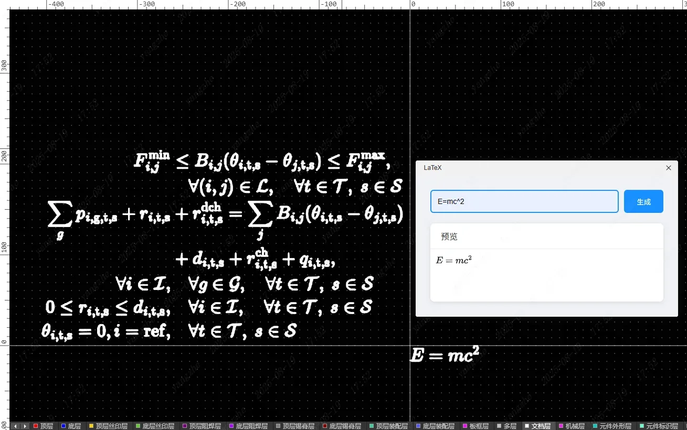
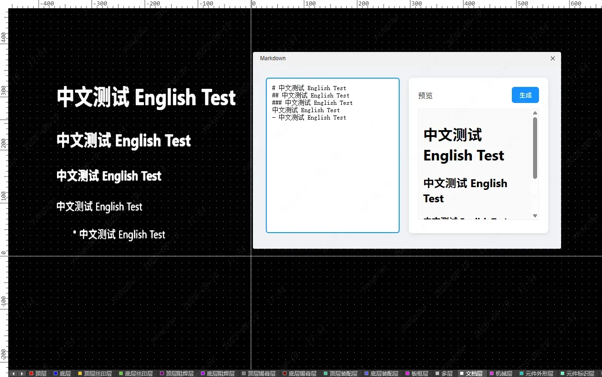
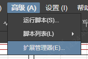
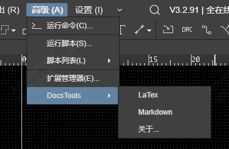

[简体中文](#) | [English](./README.en.md)

## Note-Tools注释工具

嘉立创EDA & EasyEDA 专业版支持 Markdown & LaTeX 的注释工具

## 支持功能
### ✅LaTeX公式生成至PCB文档层

### ✅Markdown文档生成至PCB文档层

## 使用方法
1.在"高级"-"扩展管理器"中导入docs-tools.eext扩展文件。

2.进入PCB界面，点击顶部导航栏"DocsTools"选择需要的功能即可。

